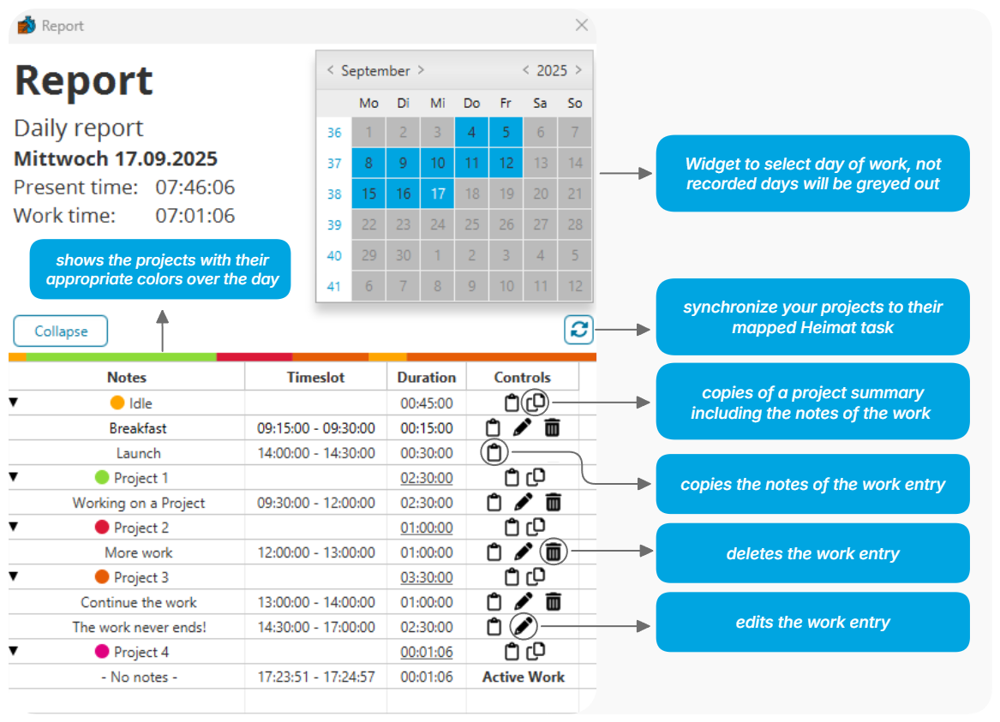

# KeepTime

Application to track your time spent on different projects each day. Aim was to create an easy and fast way to track the doings over the day. In the end you get a summary for the day.

Create projects and choose if they are counted as 'work time'. Select the project you work on. Before you switch the project, write a comment on what u did. Change the project. Repeat.

KeepTime can connect to [Heimat](https://heimat-software.com/) so you can import Heimat projects and sync your tracked time back to Heimat. Details: [heimat.md](readme/heimat.md).

## Usage

### Main view:
  

+ You can move the window by dragging it around
+ Open the context menu (with a right-click) for a project to edit/delete or change the project and transfer n minutes of the current running one
+ In the taskbar you will also see the current time + the color of the active project
+ The current Project will be saved every minute to mitigate loss on system crash or shutdown without closing window manually first. 
+ After a day you can open the Reports, which will summarize the work done for the different projects during the day

**You need to close the application manually before you shut down your PC. Otherwise, the last running project is not saved completely to database. (will be last state saved by auto-save)**

### Settings:

+ Colors: you can define various colors to use in the UI to customize the application. The Reset resets the color to the default color.
+ Display projects on the right: Will show the list of projects on the right side, instead of the left
+ Hide projects on mouse leave: If you don't hover over the application the project list collapses
+ Use Hotkey (`Strg`+`Win`): Change the project by using the Hotkey feature. A popup will appear at the mouse cursor.
+ Save Position on Screen: Remembers the last position of the Main UI on application start.
+ Ask for notes when switching project (if empty): Pops up a dialog to add notes if no notes are given and you try to switch projects
+ Export: export database for backup and later import (import currently not yet implemented)

### Reports:

KeepTime’s reporting workflow works by tracking daily work and synchronizing project activities with external task management. Here’s how you use it:

1. **Track Your Work**  
   Throughout your workday, log activities and assign them to projects. Each entry includes a timeslot, duration, and optional notes.

2. **Review Your Daily Report**  
   At any time, open the report view to see an overview of your day, including all logged activities, their durations, and project associations.

3. **Edit and Manage Entries**  
   Use the controls in the report to copy, edit, or delete individual work entries as needed. You can also copy notes or summaries for external use.

4. **Select the Day to View**  
   Use the calendar widget to select which day’s report you want to review. Only days with recorded work are available.

5. **Synchronize Projects with Heimat**  
   If you want you can syncronize the current date with Heimat. See [heimat.md](readme/heimat.md)

## Install

* Download keeptime-\<version\>.zip (see [releases](https://github.com/doubleSlashde/KeepTime/releases))
* Extract the downloaded .zip
* Try starting the application by executing the *keeptime.bat* file. The start may take up to one minute.

It is recommended to run the application at computer start, so you do not forget to track your time. For autostart also execute the following steps (for windows)
* Open the autostart folder: Press *Windows+R*, execute *shell:startup*
* Create a shortcut to the *.bat* in the autostart folder

You should put the .jar in an extra folder as a *logs* and a *db* folder will be created next to it.\

## Update KeepTime
1. Start your current version of KeepTime
1. Open `Settings` -> `Import/Export` -> `Export` to export your data to an .sql file (Backup data)
1. Stop KeepTime
1. Download new version of KeepTime and extract it
1. Start new version of KeepTime
1. If your projects are available you are already done. But most likely your projects are missing. In this case follow the [Migrate](#Migrate) chapter
     - Missing data is expected behavior with most updates as updates often include database version update which require an import of data

### Migrate data
1. Notice that your old data is not available after an update 
1. Open the new version of KeepTime
1. Open `Settings` -> `Import/Export` -> `Import` and import the previously exported .sql file 
1. After the import KeepTime closes automatically
1. Start KeepTime
1. Your data is restored in the new version now

### Migrate from version older than v1.2.0

1. Download new version and replace the .jar file.
2. Start new version of KeepTime. Notice that your old data is not available.
3. Stop KeepTime
4. Copy the files (not directories) of directory `db` (next to the .jar file) into `db/1.4.197/` (path now includes the database version).
5. Start KeepTime again. Notice that your data is available again.

## Requirements
* Operating System
  * Windows 7, 10, 11
  * Linux (tested on Ubuntu 18.04, Fedora Workstation 43)
  * Mac (tested on MacBook M2 Pro (ARM based CPU))
* Java >= 17
