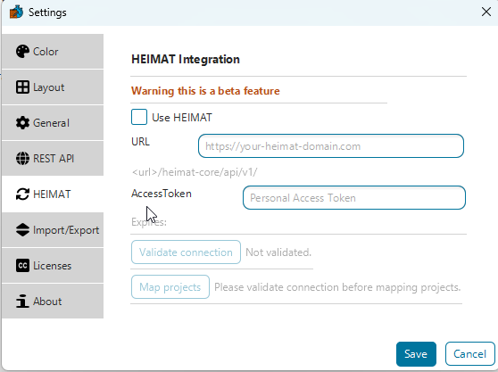
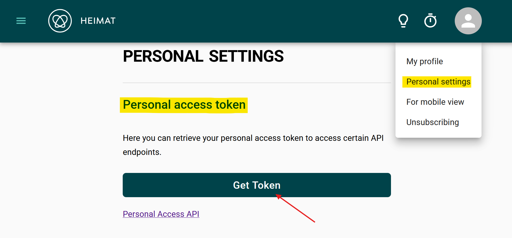
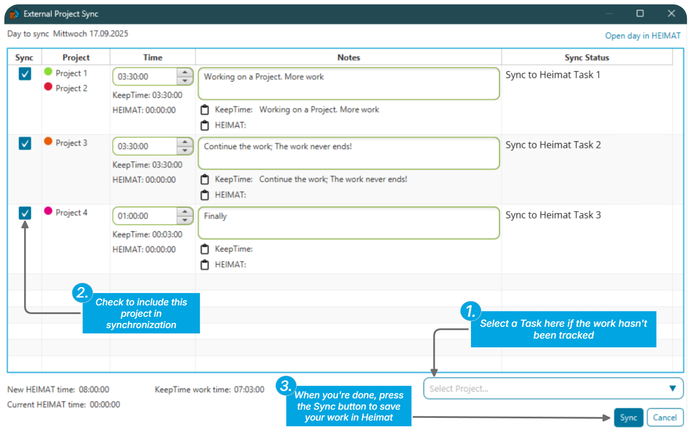

# Heimat integration

[Heimat](https://heimat-software.com/) is external project and time-tracking software. KeepTime can connect to it so you can:

- **Import** projects from Heimat into KeepTime, or **link** Heimat projects to projects you already have in KeepTime.
- **Push** the time you logged in KeepTime for a given day into Heimat when you choose to sync.

**Important:** KeepTime never writes to Heimat on its own. Data is sent to Heimat only when you run the sync from the report view.

---

## 1. Connect KeepTime to Heimat

1. Open **Settings** and go to the **HEIMAT** section.

   

2. Fill in:

   | Field            | What to enter                                                                                                        |
   | ---------------- | -------------------------------------------------------------------------------------------------------------------- |
   | **URL**          | Your Heimat instance URL (the same base URL you use in the browser), for example `https://your-company.example.com`. |
   | **Access token** | Create or copy a token in Heimat (under your account or API settings) and paste it here.                             |

   

3. Click **Validate connection**. If it succeeds, the integration is ready to use.

---

## 2. Match Heimat projects to KeepTime

After a successful connection, use **Map projects** (button in Heimat settings dialog) to either:

- Map each Heimat project to an existing KeepTime project, or  
- Import Heimat projects as new KeepTime projects.

Do this once (or whenever your project lists change) so KeepTime knows where each Heimat project should go.

---

## 3. Sync a day’s work to Heimat

When you want to upload time for the **currently selected day** in the report:

1. Open the **report** view for that day.
2. Click the **sync** button (Heimat / external sync).
3. In the dialog, choose which projects to include and add any **note** you want stored with the sync.
4. Click **Sync** to send that day’s tracked time to Heimat.

Until you complete step 4, nothing is written to Heimat.
